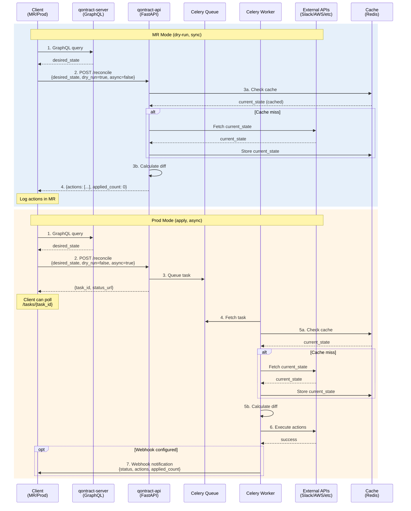

# qontract-api POC Plan

## Executive Summary

This POC introduces **qontract-api**, a REST API service that modernizes qontract-reconcile by splitting it into a client-server architecture. The API enables faster GitLab MR validations, better resource utilization, and provides utility endpoints for operational tasks.

### Current Problem

- GitLab MR jobs take too long (1-60 min)
- Each MR job requires dedicated resources and secrets
- No API for operational utilities (AWS actions, cache invalidation)
- Difficult to scale horizontally

### Solution

**qontract-api** centralizes reconciliation logic and provides:

1. **Reconciliation Endpoints**: Client sends desired_state → API calculates diff → Returns actions
2. **Utility Endpoints**: Execute operational tasks (S3 bucket empty, DynamoDB backup, etc.)
3. **Caching Layer**: Reduce external API calls (Slack, AWS, etc.)
4. **Async Task Execution**: Long-running operations via Celery

## Architecture



### Technology Stack

- **API Server**: FastAPI (Python 3.12)
- **Task Queue**: Celery
- **Cache/Broker**: Redis, DynamoDB/Firestore (future)
- **Authentication**: JWT with revocation list
- **Repository**: Monorepo with uv workspaces in qontract-reconcile
- **Client Library**: Auto-generated from OpenAPI spec via openapi-python-client

## Key Technical Decisions

### Repository Structure: Monorepo with uv Workspaces

**Decision**: Integrate qontract-api into existing qontract-reconcile repository as workspace

**Rationale**:

- Shared code (reconcile.utils) can be imported directly
- Unified CI/CD pipeline
- Easier development (no need to version/publish multiple packages)
- Atomic changes across reconcile code and API in same PR

**Structure**:

```text
qontract-reconcile/
├── pyproject.toml                    # Root workspace config
├── reconcile/                        # Existing integration code
├── qontract_api/                     # NEW: API server workspace
│   ├── pyproject.toml
│   └── qontract_api/
│       ├── main.py                   # FastAPI app
│       ├── auth/                     # JWT authentication
│       ├── cache/                    # Cache backends
│       ├── integrations/             # slack_usergroups, etc.
│       └── tasks/                    # Celery tasks
├── qontract_api_client/              # NEW: Auto-generated client
│   └── qontract_api_client/
└── docker-compose.yml
```

### GraphQL Data Fetching: Client-Side Only

**Decision**: qontract-api does NOT query qontract-server

**Client workflow**:

1. Client fetches desired_state from qontract-server (GraphQL)
2. Client sends desired_state as POST body to qontract-api
3. API fetches current_state from external systems (Slack, AWS, etc.)
4. API calculates diff and returns actions

**Rationale**:

- Clear separation of concerns
- API remains stateless and focused on reconciliation
- No GraphQL client needed in qontract-api
- Client controls what data is sent

### Job Queueing: Custom Redis Lock Decorator

**Decision**: Implement custom Redis-based task deduplication instead of external libraries

**Rationale**:

- Available libraries (celery-singleton, celery_once) are unmaintained (last updates 2017-2021)
- Simple implementation (~40 lines) with full control
- No external dependencies beyond redis-py (already used)
- Easy to test and customize

**Implementation**:

```python
from redis import Redis
from functools import wraps

def deduplicated_task(lock_key_fn, timeout=600):
    """
    Decorator for task deduplication using Redis locks.

    Args:
        lock_key_fn: Function to generate lock key from task args
        timeout: Lock timeout in seconds (default: 10 minutes)
    """
    def decorator(func):
        @wraps(func)
        def wrapper(*args, **kwargs):
            redis_client = Redis.from_url(settings.REDIS_URL)
            lock_key = f"task_lock:{func.__name__}:{lock_key_fn(*args, **kwargs)}"

            # Non-blocking lock acquisition
            lock = redis_client.lock(lock_key, timeout=timeout, blocking=False)

            if not lock.acquire():
                logging.info(f"Task {lock_key} already running, skipping")
                return {"status": "skipped", "reason": "duplicate_task"}

            try:
                return func(*args, **kwargs)
            finally:
                lock.release()

        return wrapper
    return decorator

# Usage
@celery_app.task(bind=True)
@deduplicated_task(lambda workspace, **kw: workspace, timeout=600)
def reconcile_slack_usergroups_task(self, workspace: str, ...):
    # Task logic - only runs if no other task for this workspace is active
    pass
```

**Benefits**:

- Simple, maintainable code (~40 lines)
- Full control over lock behavior
- No unmaintained dependencies
- Redis-based distributed locking with TTL
- Works with standard Celery monitoring tools

### Cache Backend: Abstracted Interface

**Decision**: Abstract cache interface with multiple implementations

**POC**: Redis
**Production**: Redis, DynamoDB, or Firestore

**Cache Strategy**:

```python
# Cache Keys & TTLs
slack_usergroups:{workspace}:{usergroup}:current  # 5 min
slack:users:{workspace}                            # 15 min
slack:channels:{workspace}                         # 15 min
```

**Important**: NO GraphQL data caching. Client always fetches fresh data from qontract-server.

### Authentication: JWT with Revocation

**Decision**: JWT tokens with Redis-based revocation list

**Features**:

- JTI (JWT ID) for revocation tracking
- Redis-backed revocation list with TTL
- REST endpoints for token management

**Token lifecycle**:

- Create token: `POST /auth/tokens`
- Revoke token: `POST /auth/tokens/revoke`
- Revoke all user tokens: `POST /auth/tokens/revoke-user`

### Migration Strategy: Independent Rollout

**Decision**: Deploy qontract-api in parallel with existing integrations

**Approach**:

- Old integration (reconcile/slack_usergroups.py) remains unchanged
- New integration (reconcile/slack_usergroups_api.py) uses qontract-api
- Feature flag controls which mode to use (both implementations using different flags)

**Rollback**: Switch feature flag back to direct mode

#### Detailed Migration Steps

- Migrate each integration one at a time (start with slack_usergroups)
- Monitor metrics and logs closely
- Rollback in case of issues

## POC Scope

### Must Have (Before POC Launch)

**Health & Monitoring**:

- ✅ Health check endpoints (liveness + readiness)
- ✅ Request ID tracking through entire stack
- ✅ Standardized error codes & error responses

**Security & Reliability**:

- ✅ JWT authentication with revocation
- ✅ Request input validation
- ✅ Distributed locking for concurrent requests. Don't allow multiple reconciliations for the same integration simultaneously.

**Core Functionality**:

- ✅ slack_usergroups reconciliation endpoint
- ✅ Cache invalidation endpoint
- ✅ Sync and async execution modes
- ✅ Auto-generated client library (openapi-python-client)

### Should Have (POC Phase 2)

**Observability**:

- ✅ Structured logging with request IDs
- ✅ Prometheus metrics implementation
- ✅ Load testing with Locust

**Operations**:

- ✅ Feature flags with Unleash (for gradual rollout)
- ✅ Graceful shutdown handling
- ✅ Webhook support for async notifications

**Rate Limiting**:

- ✅ Rate limiting integrated in `reconcile/utils/slack_api.py` (central implementation)
- ✅ Token bucket algorithm with Redis backend
- ✅ Sync support via `acquire_sync()` method
- ✅ Shared rate limits across all API instances via Redis
- ✅ Opt-in for existing integrations (backward compatible - disabled by default)
- ✅ Enabled automatically in qontract-api via `SlackApiFactory`
- ✅ No code duplication - all consumers benefit from central implementation

### Nice to Have (Production)

**Advanced Features**:

- ✅ Token rotation strategy
- ✅ Cache warming
- ✅ Per-user rate limiting (in addition to global rate limiting)
- ✅ Rate limiting for other APIs (Jira, GitHub, AWS)

### Deferred to Later

**Not in POC Scope**:

- OpenTelemetry distributed tracing
- Multi-region deployment
- Comprehensive audit trail (database-backed)
- API versioning strategy
- Advanced monitoring (SLO/SLA tracking)

## Implementation Phases

### Phase 1: Project Setup

**Deliverables**:

- Workspace structure (uv workspaces)
- Docker Compose setup (API + Celery + Redis)
- Dependencies configured
- Basic FastAPI app running

### Phase 2: Core Infrastructure

**Deliverables**:

- Cache backend interface + Redis implementation
- JWT authentication
- Celery setup with custom lock
- Health check endpoints
- Error handling & logging

### Phase 3: slack_usergroups API

**Deliverables**:

- Reconciliation endpoint (sync + async)
- Service layer refactoring from reconcile/slack_usergroups.py
- Client implementation (reconcile/slack_usergroups_api.py)
- Caching strategy
- Webhook support

### Phase 4: Utility Endpoints

**Deliverables**:

- AWS reboot RDS instances utility
- Auto-generated client library (openapi-python-client)
- Client library publishing

### Phase 5: Testing & Documentation

**Deliverables**:

- Unit tests (>80% coverage)
- Integration tests
- API documentation (auto-generated Swagger)
- Deployment guide
- Migration guide

### Phase 6: Integration & Deployment

**Deliverables**:

- CI/CD integration
- App-interface configuration
- OpenShift deployment manifests
- Monitoring and alerts setup

## Success Criteria

**Technical Validation**:

- [ ] qontract-api runs locally with Docker Compose
- [ ] JWT authentication works
- [ ] slack_usergroups reconciliation via API (dry-run)
- [ ] slack_usergroups reconciliation via API (apply)
- [ ] Caching works (verified via logs)
- [ ] Celery tasks for async reconciliation
- [ ] Task deduplication works
- [ ] Utility endpoints functional
- [ ] Client library works
- [ ] Tests: >80% coverage
- [ ] Documentation complete

**Performance Goals**:

- MR validation time reduced from 10-30 min to <5 min
- Cache hit rate >70% for repeated requests
- API response time <2s for dry-run requests
- Async task execution <10s for typical reconciliation

## Migration Path for Additional Integrations

After successful POC with slack_usergroups:

**Phase 1: Define Standards**

- Standardized desired_state format
- Standardized actions format
- Common error handling patterns

**Phase 2: Template Generation**

- Template for integration endpoints
- Code generator based on integration spec

**Phase 3: Gradual Migration**

- Priority 1: Integrations running frequently in MRs
- Priority 2: Integrations with long runtimes
- Feature flag per integration

**Phase 4: Metrics & Monitoring**

- Prometheus metrics for all API calls
- Grafana dashboards
- Alerting for high error rates

## Deployment Architecture

### Local Development

**Docker Compose**:

- API server (FastAPI with uvicorn)
- Celery worker (3-5 instances)
- Redis (cache + broker)

**Environment variables**:

```bash
JWT_SECRET_KEY=dev-secret-key
REDIS_URL=redis://localhost:6379/0
CACHE_BACKEND=redis
LOG_LEVEL=debug
```

### Production (OpenShift)

**Components** (defined in app-interface):

- API server deployment (2-3 replicas)
- Celery worker deployment (3-5 replicas)
- Redis deployment (persistent storage)
- Public route (HTTPS with cert)

**Secrets** (from Vault):

- JWT_SECRET_KEY
- SLACK_TOKEN (per workspace)
- AWS credentials (for utility endpoints)

**Monitoring**:

- Prometheus metrics (same format as qontract-reconcile)
- Grafana dashboards
- AlertManager rules

## Next Steps

1. ✅ Review and approve POC plan
2. Create qontract_api workspace in qontract-reconcile repo
3. Start Phase 1: Project setup
4. Weekly sync meetings for feedback
5. After POC: Go/No-Go decision for full migration

## Reference Documents

**Implementation Guide**: See [POC_IMPLEMENTATION_GUIDE.md](POC_IMPLEMENTATION_GUIDE.md) for detailed technical implementation.
